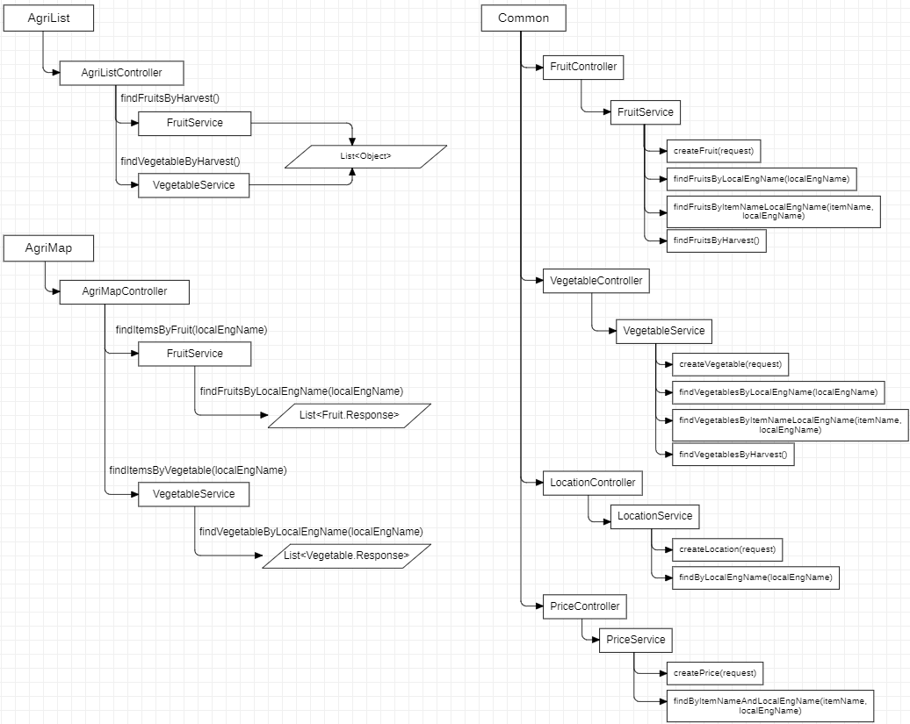

# PaldoBobusang
PaldoBobusang is a web application that provides information about seasonal foods in Korea built with  
    
"Paldo" in Korean means the eight provinces of Korea and "Bobusang" means vendors who sold small goods or foods, traveling around different marketplaces during the Joseon dynasty.  
This project was built under alternative username [@ldc-bootcamp01](https://github.com/ldc-bootcamp01) during the En-core Playdata bootcamp.

  

## Overview
With PaldoBobusang web application, you can:
- Find detailed information about seasonal food currently being produced. provided through database for agricultural products
- Compare the prices and price trends of seasonal foods currently being distributed using agricultural product distribution OPEN API
- Provides information on seasonal foods currently being produced during the season by region based on location using domestic maps

## Architecture Layout

`/List` : Show overall list of seasonal foods and display detailed information when clicking on a product.

`/Map` : Display seasonal food information for the desired region by clicking on the desired region on the nationwide map (8 provinces).

## Domain Terminologies
`Product`: Each seasonal agricultural product (e.g., apples, cabbage, etc.)  

`Breed`: Types of the product (e.g., Aori apples, Hongro apples, Yangkwang apples, Busa apples)

## Entity Relationship Diagram

## Service Architecture
Relationship diagram showing dataflow between **frontend**, **backend**, online **open API**, and **database**.

## RestAPI Document

[https://documenter.getpostman.com/view/23095082/2s7ZLhnWb8](https://documenter.getpostman.com/view/23095082/2s7ZLhnWb8)

